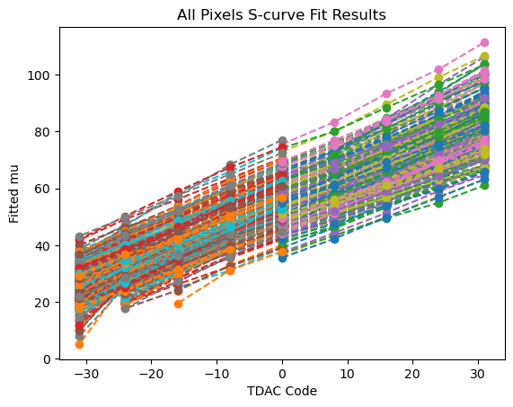
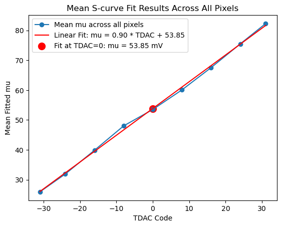
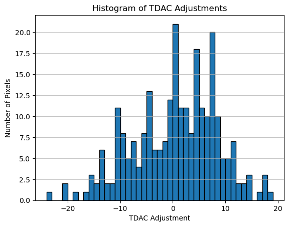

# Analisi dei dati DAC

Di seguito un riepilogo delle operazioni eseguite e dei risultati ottenuti.

## Dati di partenza
I dati grezzi si trovano nella cartella `data`. Per aggregare le misure relative a diversi `tdac` code e a `tup` = 0 o 1 è stato utilizzato lo script:
```bash
data_combiner.py
```
Output: `combined_data.csv`

## Estrazione dei parametri (SCurve)
L'analisi delle SCurve è stata eseguita con il notebook:
```text
scurve-parameters-getters.ipynb
```
Output: `scurve_fit_result.csv`  
Questo file contiene i parametri (media e varianza) per ciascun pixel, per ogni combinazione di `tdac_code` e `tup`.

## Fit lineare e scelta del TDAC per pixel
È stata calcolata la media delle medie dei vari `tdac` code e applicato un best-fit lineare per stimare la relazione fra `tdac` e soglia. Sulla base di questo fit è stato sviluppato l'algoritmo di tuning che determina il `tdac` da assegnare a ciascun pixel.

Immagine: andamento delle medie per tdac  


Immagine: scelta del `tdac` per pixel (fit lineare)  


Il tuner produce come output il file:
```text
tdac_tuning_results.tsv
```
da utilizzare come input per il software di misure del chip.

## Distribuzione dei codici trovati
È stata verificata la distribuzione dei `tdac` assegnati tramite un istogramma: la distribuzione è approssimativamente normale e i codici ottenuti non saturano il range operativo del DAC (valori massimi intorno a 20).



## Prossimi passi
- Applicare il tuning suggerito dal file `tdac_tuning_results.tsv` su uno o più pixel di test.
- Eseguire misure post-tuning e confrontare la dispersione delle soglie della matrice prima/dopo per verificare l’efficacia dell’algoritmo.
- Eventualmente iterare il fit o adattare la strategia di tuning in base ai risultati sperimentali.

Note: tutti i file citati (`combined_data.csv`, `scurve_fit_result.csv`, `tdac_tuning_results.tsv`) sono disponibili nella directory di lavoro del progetto.